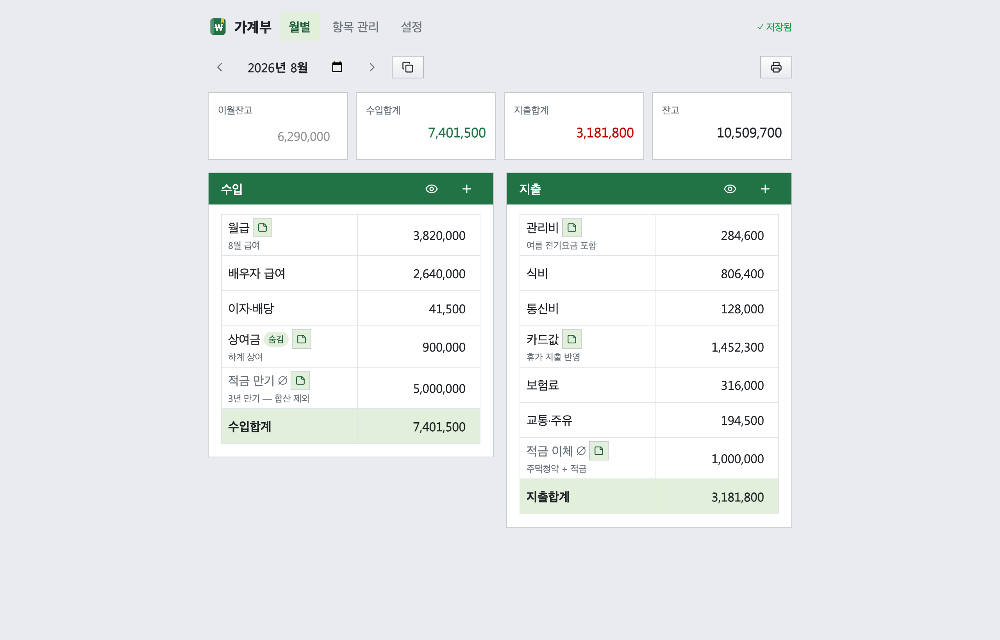
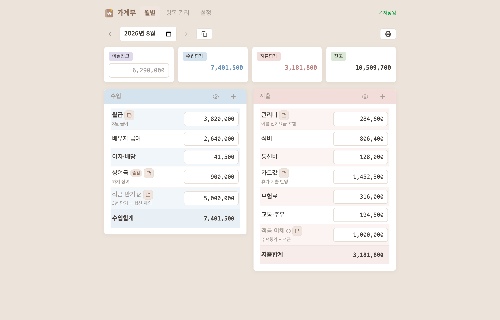
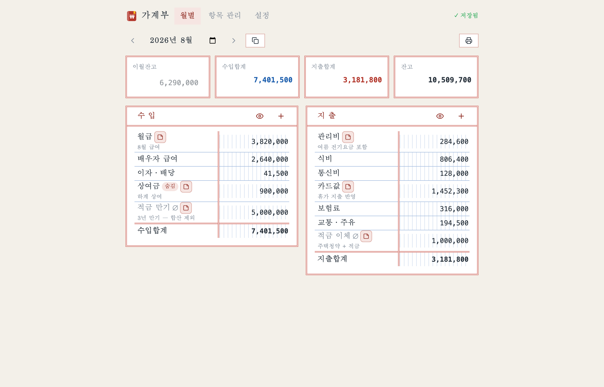
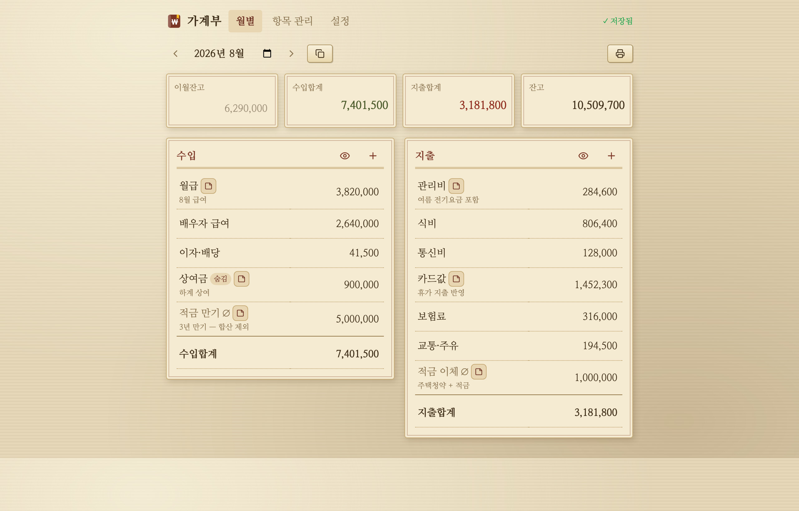
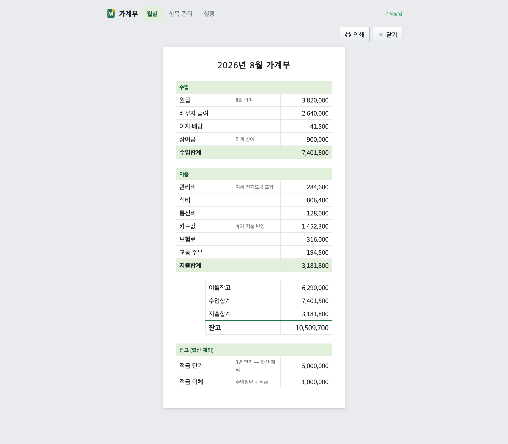
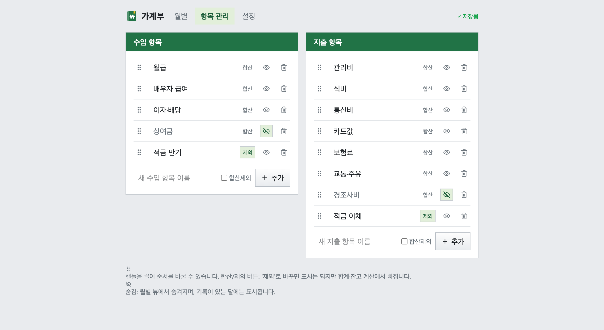
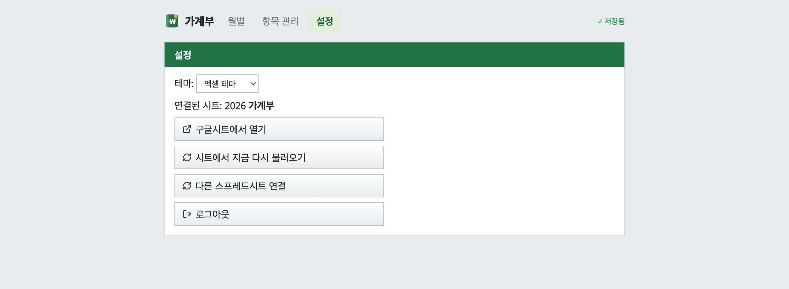

# 월간 가계부 (h-budget) — 구글시트 가계부

**https://house-budget.typostudio.dev/**

브라우저에서 구글 로그인 후 **본인 계정의 구글 스프레드시트**에 가계부를 기록하는 정적 웹앱입니다. 서버가 없으므로 데이터는 구글시트에만 저장됩니다.

## 기능

- 구글 로그인(GIS) → Sheets API 직접 호출 (달력 월 기준, 월별 항목당 금액 입력)
- 수입/지출 항목 자유롭게 추가 · 수정 · 삭제 · 순서 변경
- **합산제외 항목**: 표시는 되지만 수입/지출 합계와 잔고 계산에서 제외 (참고용 기록)
- 월별 뷰: 이월잔고(자동 = 전월 잔고, 수동 입력 가능) / 수입합계 / 지출합계 / 잔고
- 인쇄/캡처용 보기: 그 달 요약을 한 장으로 정리해 인쇄하거나 **PNG 이미지로 저장** (팝업으로 이미지가 열려 길게 누르거나 우클릭해 저장)
- 스프레드시트 연결: 기존 시트 URL 붙여넣기 또는 새 스프레드시트 생성
- 기존 `가계부` 시트(엑셀 형식)가 있으면 **데이터 가져오기** 지원

## 데이터 구조

**`가계부` 시트 하나가 곧 데이터베이스**입니다. 앱 전용 시트가 따로 없어, 앱 없이 시트만으로도 그대로 쓸 수 있습니다.

- 2행: 그룹 라벨(수입/지출) · 3행: 항목 헤더 · 4행~: 월별 행 (A열 = 월)
- 항목 = 열. 이름·순서는 헤더와 열 순서, 합산제외/숨김 플래그는 **헤더 셀의 메모(note)** 로 저장
- 금액 수식(`15000-5000`)은 실제 시트 수식으로, 기록 메모는 **셀 메모(note)** 로 저장
- 이월잔고: 셀이 순수 값이면 수동 입력, 수식이면 자동 계산으로 인식
- 앱이 만든 시트는 지출합계·잔고·이월 수식을 앱이 유지 관리하고, 자체 계산 열(월급·카드합계 등)이 있는 기존 시트는 그 수식을 건드리지 않으며 새 월은 이웃 행을 복사해 추가
- 예전 버전의 `가계부앱_항목`/`가계부앱_기록` 시트가 있으면 최초 연결 때 자동으로 이전되고 탭 이름에 `_이전`이 붙습니다

## Google Cloud 설정

OAuth 클라이언트 ID는 `src/App.tsx`의 `CLIENT_ID` 상수에 고정되어 있습니다. 해당 GCP 프로젝트에서:

1. **Google Sheets API** 사용 설정 (필수)
2. **Google Picker API**(및 Google Drive API) 사용 설정과 **API 키** 발급 — 시트 선택 창에 필요. `src/App.tsx`의 `PICKER_API_KEY`가 비어 있으면 선택 버튼이 숨겨지고 URL 붙여넣기·새로 만들기만 동작
3. OAuth 클라이언트의 승인된 JavaScript 원본에 `http://localhost:5173` (배포 시 배포 주소도) 추가

로그인 토큰은 localStorage에 저장되어 새로고침 후에도 약 1시간 유지되며, 만료 시 자동 갱신을 시도합니다.

## 테마

설정 탭의 테마 선택으로 전환합니다. 엑셀(셀 격자) / 파스텔 / 장부(줄노트) / 고서(15세기 양피지) 네 가지이며, 아래는 각 테마의 월별 화면입니다.

| 엑셀 | 파스텔 |
|---|---|
|  |  |

| 장부 | 고서 |
|---|---|
|  |  |

### 화면

월별 외 나머지 화면입니다 (엑셀 테마 기준).

| 인쇄/캡처용 보기 | 항목 관리 | 설정 |
|---|---|---|
|  |  |  |

네 테마 × 네 화면 조합 16장 전체는 `screenshots/{excel,classic,ledger,manuscript}-{month,print,cats,settings}.png` 에 있습니다.

## 실행

```bash
npm install
npm run dev      # http://localhost:5173
npm run build    # dist/ 정적 파일 생성
```

배포는 `firebase deploy --only hosting`으로 `dist/`를 Firebase Hosting에 올립니다 (`firebase.json`의 사이트 `house-budget-typostudio`, 커스텀 도메인 `house-budget.typostudio.dev`). 기존 GitHub Pages 주소는 새 주소로 넘기는 리다이렉트(`redirect/`)만 배포합니다.

배포 주소를 OAuth 클라이언트의 "승인된 JavaScript 원본"에 추가하는 것을 잊지 마세요.
